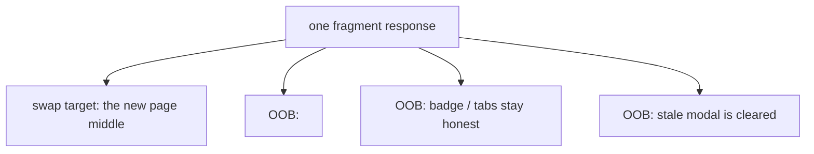

# Out-of-band swaps — why they exist, and when to use them

> On htmx 4 the renderer ships these extra-region updates as partials (`<template hx type="partial" hx-target="…" hx-swap="…">`), not `hx-swap-oob` attributes. The behavior below is unchanged. The helpers in `seg.go` (`OOBTitle`, `ClearModal`, `NotifBadge`) keep their names but now emit partial templates.

## The problem: fragment navigation leaves holes

A fragment navigation swaps in the _middle_ of the page. But a page is more than its middle:

- The **tab/browser title** doesn't get swapped — it lives in `<head>`.
- **Chrome** outside the swap target (a notification badge in the header, a tab bar) stays whatever it was.
- **Transient UI** — an open modal, a toast — has no reason to exist anymore, but nothing told it to go away.

If nothing handles these, every page view ends up in a half-updated state: correct middle, stale title, stale badge, orphaned modal.

## What OOB gives you

htmx's `hx-swap-oob` lets a single response touch **any number of elements**, wherever they are on the page — not just the swap target. So instead of extra round-trips to sync the chrome, the one fragment response _also_ carries the fix for the title, the badge, the tabs, and the modal. One request, whole page correct.

That's the mental model to carry: **the response is the full page's truth; the swap target is just the default place it lands.** Everything else it mentions gets fixed out-of-band, and everything it _doesn't_ mention is assumed still correct.



## What the renderer does for you automatically

The segment renderer already appends the three most common extra-region updates to every fragment, so you get them for free:

1. **`OOBTitle`** — a partial replaces the `<head>` `<title>` with every navigation. Without it, the tab name would describe the page you _came from_.
2. **`ClearModal`** — a partial swaps an empty `#modal-root`, so navigating away from a modal tears it down. (Responses that are _about_ the modal target `#modal-root` directly and intentionally omit this — that's what keeps the modal open.)
3. **The `segments` trigger** — not a DOM swap but a custom event telling the client which segments are now mounted, so the _next_ request reports a correct stack. This is the "state" that keeps the whole diff cheap.

## When _you_ reach for OOB: chrome that can go stale

The rule: **if a piece of UI is visible during a fragment navigation but isn't part of the swap, and its content depends on the action, it needs an OOB update** — or it silently drifts from reality until a full reload.

### Example: the notification badge

Clicking "Mark all read" posts to a handler that has no HTML to swap (`hx-swap="none"`). The visible badge in the header still shows 3. One response fixes both halves of the problem:

```go
r.Post("/notifications/read", func(w http.ResponseWriter, r *http.Request) {
    seg.Invalidate("dashboard", seg.SessionID(w, r)) // next load refetches user
    w.Header().Set("HX-Trigger", `showToast`)
    _ = seg.NotifBadge(0).Render(r.Context(), w)     // OOB: badge swaps now
})
```

- **Invalidate** makes the _next_ full render correct (the cached user is dropped).
- **`NotifBadge(0)`** makes the _current_ screen correct immediately, via OOB.

Notice it also swaps in a hidden badge rather than a "0" — the badge disappearing is the correct empty state, not a visible zero.

### Example: the settings tab bar

Settings tabs render in two places — the full page and the modal — and both can exist at once. When you click a tab inside the modal (a `keep` swap), the tab bar must reflect the new selection _in both trees_:

- The **modal's** tab bar is part of the swap context (the leaf renders inside it), and
- the **page's** tab bar behind the modal needs an OOB `outerHTML` swap, or it stays on the old tab and you're wrong as soon as the modal closes.

Two things make this work:

- **Distinct ids** (`settings-tabs` vs `settings-tabs-modal`) so the two swaps never collide — this is a general rule: _modal chrome and page chrome must never share an id_.
- **`outerHTML`** for the OOB swap, because the whole `<nav>` is being replaced, not just its contents.

### Example: feedback with no HTML at all

"Export" changes nothing on screen — it just needs to say "done". Rather than fabricate a swap target, the handler sets an `HX-Trigger` (`showToast`), and a listener in `app.js` renders a transient toast. Same philosophy as OOB — the response carries the update — just delivered as an event instead of a DOM swap.

## Decision guide

| Situation                                    | What to do                                                                                |
| -------------------------------------------- | ----------------------------------------------------------------------------------------- |
| Navigating between pages                     | Renderer handles title, modal cleanup, stack trigger automatically.                       |
| Chrome whose data you just mutated           | Partial-swap it in the mutation handler (badge), or invalidate so the next render is correct. |
| Same chrome exists in a modal _and_ the page | Two distinct ids; partial both where needed.                                                  |
| Replacing a whole element (nav, list)        | `hx-swap="outerHTML"` partial.                                                               |
| Clearing/emptying a container (modal)        | Partial-swap `#modal-root` innerHTML.                                                         |
| An action with no visible result             | `HX-Trigger` event (toast), not a fake swap.                                              |
