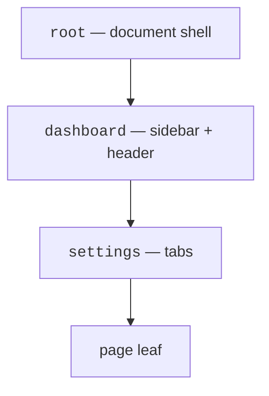
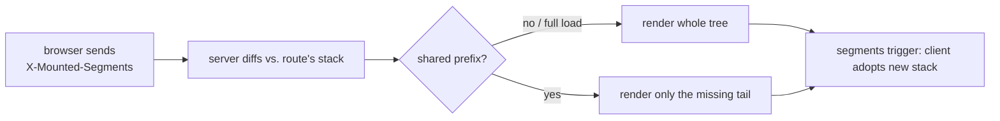

# The segment stack — why it's shaped this way

## The problem it solves

Server-rendered apps are simple: every request renders a whole page, the browser replaces it, done. But that means **every navigation re-sends the chrome** — the nav bar, the sidebar, the header — even though only the middle of the page changed. You pay for the whole page on every click.

The usual fix is a client-side router with an API: snappy, but you've now got two sources of truth for what's on screen, and every URL needs JS to render.

This template takes a third path: **the browser already has most of the page. So just send the part it doesn't.**

## The core insight: the page is a stack

However deep a page is, its layout is a fixed chain: the root document wraps a marketing or auth or dashboard segment, which wraps a settings segment, which wraps the page leaf.



The key property: **that chain has a stable identity across navigation.** `/dashboard/settings` and `/dashboard/settings/billing` both live under `root → dashboard → settings`. If the browser tells the server which segments it already has mounted, the server can compute the _common prefix_ and render only what's missing — the tail, or just the leaf.

This is why the docs say "only the missing tail" rather than "only the changed segments": the layouts don't _change_, they're already on screen. What changes is how deep you are in the stack, and the tail is precisely what's new.

## Why a "segment" is the unit

A segment is a layout that can answer two questions: **what's the identity of this layout** (its `ID`), and **what does this layout wrap** (its `Render`, taking a child). That's the whole contract:

```go
type Segment struct {
    ID     string
    Render func(ctx context.Context, data any, child templ.Component) templ.Component
}
```

`ID` is what makes the diff possible — it's the thing the browser reports in `X-Mounted-Segments`, and the thing the server uses to decide what's already there. `Render` is what makes a layout composable — every segment knows how to draw itself around its child.

Everything else on `Segment` (`Load`, `TTL`, `Scoped`, `Decode`) exists to answer a second question: **what data does this layout need, and how often should we re-fetch it?** (Covered below.)

## Why the URL decides everything

In this system the URL is the single source of truth. A route's position in the chi tree _is_ its layout — leaf handlers never name their layouts:

```go
r.Route("/dashboard", func(r chi.Router) {
    r.Use(d.Sessions.RequireAuth)
    r.Use(seg.Use(dashboard))

    r.Route("/settings", func(r chi.Router) {
        r.Use(seg.Use(settings))
        r.Get("/", seg.Modalable(...))
    })
})
```

Because the server can always render the full tree from the URL alone, three things fall out for free:

- **Deep links and reloads work** — there's no client-side state to reconstruct; the URL _is_ the state.
- **The back button works** — every navigation pushes a real URL, and the next response re-derives the layout from it.
- **Modals are free** — more on that below, but the URL being authoritative is exactly what makes "same URL, modal or full page" possible.

## Why data binds to mount, not navigation

In a typical app, the sidebar user info is fetched on every page load because the sidebar re-renders on every navigation. Here the sidebar _doesn't_ re-render — it's already on screen — so re-fetching its data would be pure waste.

A segment's `Load` runs when the segment **mounts**, and its result is cached with a TTL:

```go
dashboard := seg.Segment{
    ID:     "dashboard",
    TTL:    30 * time.Second,
    Scoped: true, // per-user: keyed by session
    Load: func(ctx context.Context) (any, error) {
        uid, ok := auth.UserIDFrom(ctx)
        if !ok {
            return nil, http.ErrNoCookie
        }
        return d.Users.ByID(ctx, uid)
    },
}
```

So click through ten dashboard pages and the profile is fetched **once** per 30s — not ten times. Navigate into a modal and the tabs' badge count is fetched once per its TTL. The rule is "data is fresh enough that a full reload won't show something different," expressed as a TTL instead of a navigation.

Two settings that follow from this:

- **`TTL: 0`** — the segment's data is always cheap/volatile and should be fetched on every request.
- **`Scoped`** — per-user data must be cached per session; shared data (feature flags, config) can be cached once globally.

`Decode` exists only because the cache _backend_ may be external (Redis stores JSON). It's how a cached value gets turned back into a typed struct. If the cache is in-memory, the live value is kept and `Decode` is never called.

## Why invalidation is explicit

The cache doesn't know when your data changed — only your mutation handler does. So after writing, you tell the cache "this segment is stale":

```go
r.Post("/notifications/read", func(w http.ResponseWriter, r *http.Request) {
    seg.Invalidate("dashboard", seg.SessionID(w, r)) // this user's cached profile
    // ...
})
```

This is a deliberate trade: an implicit invalidation (say, time-based only) would make data correctness fuzzy and hard to reason about. Explicit invalidation means **a mutation is the only thing that can make a cached value stale**, and it's always in the same handler as the write.

## Why modals are just another outlet

Because the URL always determines the full render, showing a page as a modal is just a question of **where** you put the result, not **what** you render. A header (`X-Modal`) tells the server "render the normal page, but drop it into `#modal-root` instead of the main outlet."

That's why a modal works with reload, back button, and expand-to-page with zero special-case client code:

- the URL loads as a modal (`X-Modal: page`) or a full page (no header) — same render,
- the browser "back" from a modal is a real history entry,
- "expand" is just re-rendering the same URL into the full outlet.

The four `Modalable` modes are the four places the same render can land — the main outlet, the modal shell, the open modal's inner outlet, or back out of the modal to the full page.

## The loop, end to end



Each segment in the chain does two things: ensure its cached data is in the request context (so any leaf can read it), and record its place in the stack. The renderer then sends only the tail and tells the client what's mounted now, so the _next_ request is even cheaper. The system compounds its own advantage.
